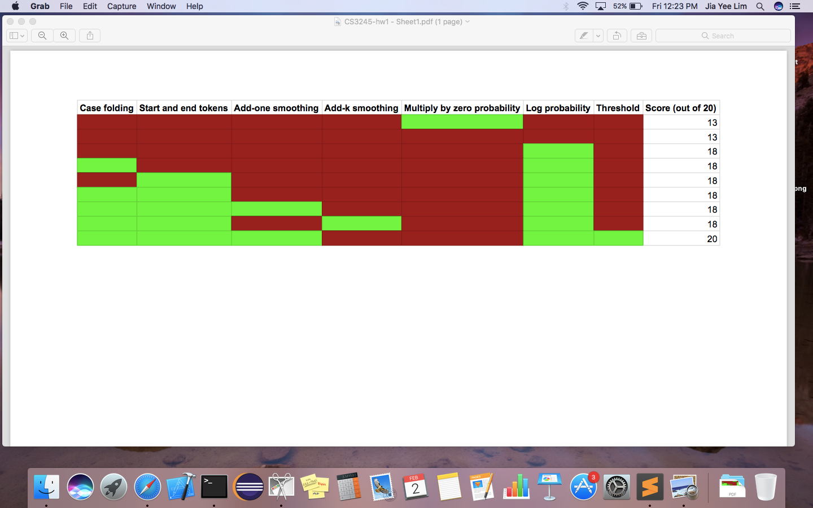

This is the README file for A0136070R's submission

### Python Version

I'm using Python Version 3.6.4 for this assignment.

### General Notes about this assignment

Give an overview of your program, describe the important algorithms/steps in your program, and discuss your experiments in general. A few paragraphs are usually sufficient.

I define a language model as a tuple of label indexer, n-gram indexer, and a 3D list as the model.

- The label indexer is a dictionary of `{ label: row index in the model }`.
- The n-gram indexer is a dictionary of `{ seen n-gram: column index across the rows in the model }`.
- The model has one or more rows, whereby each row corresponds to the language model for a label (language) and contains columns of seen n-grams mapped to their add-one smoothed log probability.

I first load the training file, and split the line into individual characters. At this stage, I can do additional processing like adding a start and end token, and case folding.

I then count the seen 4-grams generated from these sequences of characters. Unseen 4-grams from other languages will be added to the total count for each language, but with a count of 0. Add-one smoothing will then add one to each and every count.

For each test instance, I add up the log probabilitites of every 4-gram in the test instance. If there is an unseen 4-gram inside the test instance but not inside the language model, I ignore that 4-gram. Note that if so many such 4-grams are unseen and ignored, we should not blindly associate such test instance with a seen language since the model has not seen such 4-grams. As such, in one of my experiments below, I added a threshold, and it helped boost the language detection accuracy as the program is now able to realize unseen languages.

### Experiments attempted

There does not seem to be a significant difference in scores when the more subtle features are activated or deactivated (e.g. start and end token, case folding, add-one versus add-k). Some possible explanations for this phenomenon are:

1. There is not much variation between the training data and the given test data.
2. The three languages are so similar to each other that the shift of probability mass from seen to unseen 4-grams remains insignificant, and the results remain the same despite varying k.

On the other hand, utilizing log probability over multiplication of raw probability has shown to be extremely helpful. Multiplying several small probabilities will lead to values that are so close to 0, such that computers might not be able to compute such numbers precisely. Instead, summing up the exponents of these probabilities are trivial and thus accurate.

Last but not least, I added a threshold such that normalized log probability sums close to 0 will be associated with no language. While having log probabilities close to 0 would mean that the raw probability is high, having a sum that is very close to 0 also means that there are barely any seen 4-grams in the test instance that exists in a language model. This is a sign that the test instance might belong to other language models instead.

I feel that determining such threshold is non-trivial, and can be a learning problem by itself, but I also feel that this could be out-of-scope for the assignment. As such, I simply added an observed threshold that is safe for the given test data (and possibly unsafe for the blind test data).

### Files included with this submission

- `build_test_LM.py`
- `test.sh` (a script that runs `python3 build_test_LM.py -b input.train.txt -t input.test.txt -o input.predict.txt`)
- `eval.sh` (a script that runs `python3 eval.py input.predict.txt input.correct.txt`)

### Statement of individual work

Please initial one of the following statements.

[LJY] I, A0136070R, certify that I have followed the CS3245 Information Retrieval class guidelines for homework assignments.  In particular, I expressly vow that I have followed the Facebook rule in discussing with others in doing the assignment and did not take notes (digital or printed) from the discussions.  

### References

I did this assignment all by myself.
